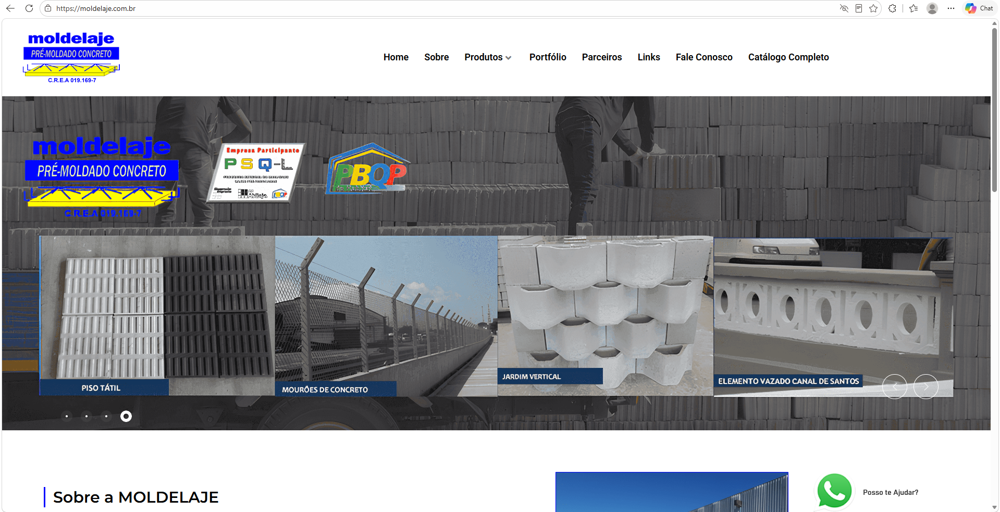
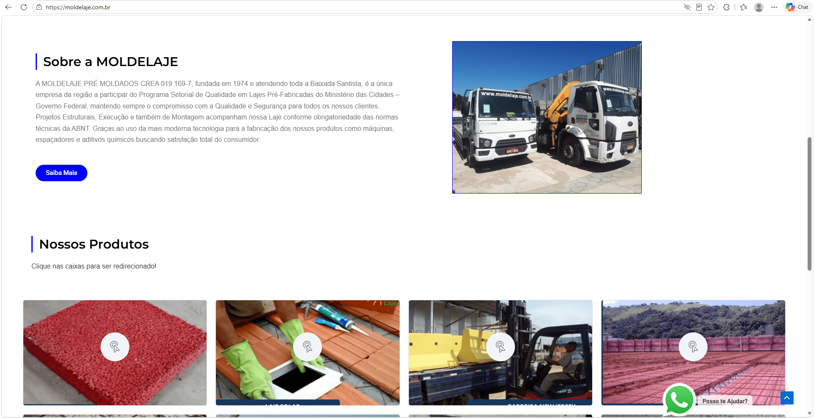
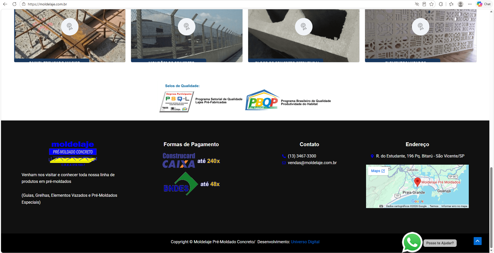

# Moldelaje Website Redesign

Modern and responsive website redesign for a construction and precast concrete company.

---

## Overview

This project was created to modernize the company's online presence and improve the user experience across all devices.

The redesign focused on:
- Modern and professional visual identity
- Improved mobile responsiveness
- Better spacing and section sizing
- Cleaner layout structure
- Stronger visual hierarchy
- Improved call-to-action areas
- Better overall user experience

---

## Before & After

### Hero Section

#### Before

#### After
<!-- Add your updated hero screenshot here -->

---

### About Section

#### Before

#### After
<!-- Add your updated about screenshot here -->

---

### Footer Section

#### Before

#### After
<!-- Add your updated footer screenshot here -->

---

## Features

- Fully responsive layout
- Modern UI design
- Improved spacing and typography
- WhatsApp contact integration
- Optimized mobile experience
- Cleaner section organization
- Professional business presentation
- Smooth scrolling navigation

---

## Technologies Used

- HTML5
- CSS3
- JavaScript

---

## Live Preview

[View Live Website](https://caiogarciadev.github.io/moldelaje-website-redesign/)

---

## Project Goals

The main objective of this redesign was to transform the company's website into a more modern, trustworthy, and conversion-focused experience while maintaining the brand identity.

---

## Author

Developed by Caio Garcia
